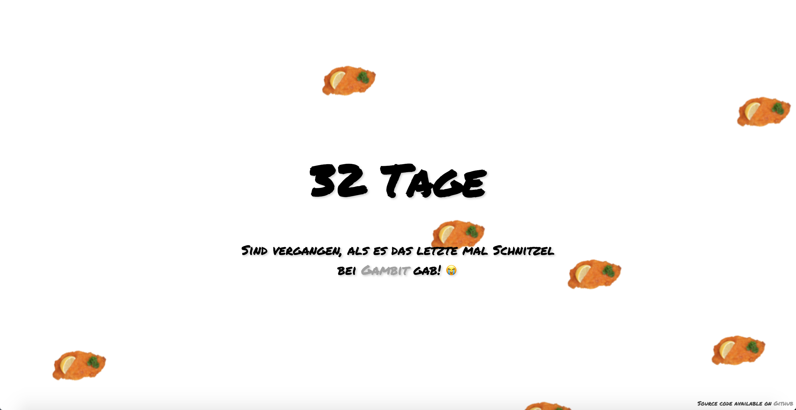

# wanngabesdasletztemalschnitzel.de
> or in english: whenwasthelasttimewehadschnitzel.de

## About
At my current employer, we have a great cantine which serves really good food, especially if it's time for [Schnitzel](https://www.google.de/search?q=schnitzel&source=lnms&tbm=isch&sa=X&ved=0ahUKEwiWoaiXx8zcAhWBuywKHbP9DkYQ_AUICigB&biw=1440&bih=743). Because of that, I created this humorous Schnitzel Countdown to know the exact amount of days the last Schnitzel was served.

## Contribution
I don't know what anybody could contribute to this project, but if you feel that you could add something funny I will not stop you from doing that! But please note that this project is released with a [Contributor Code of Conduct](https://github.com/bastilimbach/wanngabesdasletztemalschnitzel.de/blob/master/.github/CODE_OF_CONDUCT.md). By participating in this project you agree to abide by its terms.

## License
[MIT](https://github.com/bastilimbach/wanngabesdasletztemalschnitzel.de/blob/master/LICENSE) :heart:
